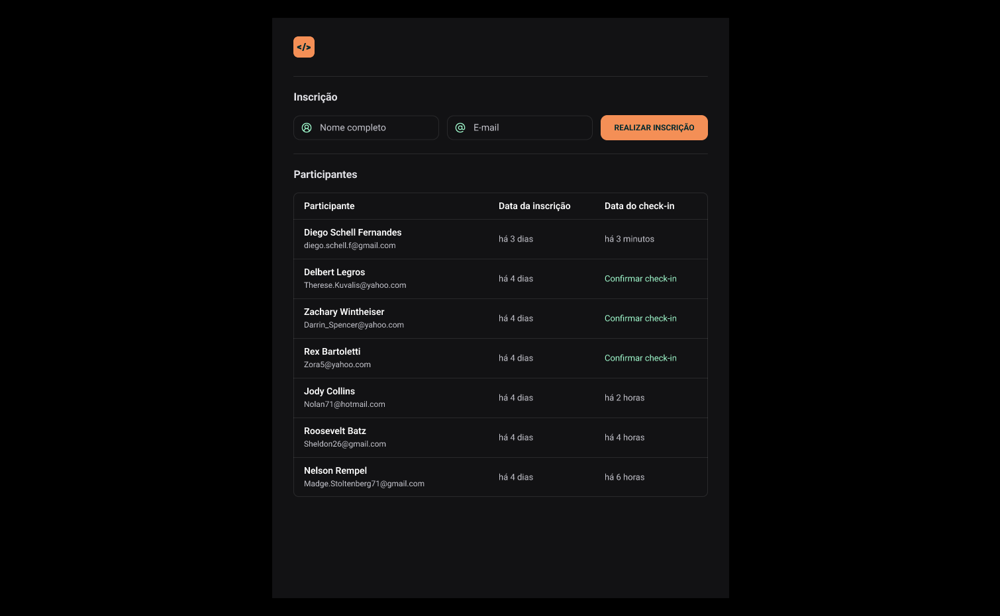

# NLW UNITE SUMMER

  

# Pass.in

  

  O Pass.in é uma aplicação **de gestão de participantes em eventos presenciais**

  A ferramenta permite que o organizador cadastre um evento e abra uma página pública de inscrição.

  Os participantes inscritos podm emitir uma credencial para check-in no dia do evento. 

  O sistema fará um scan da credencial do participante para permitir a entrada no evento.

  ## Requisitos

  ### Requisitos Funcionais 

  - [ X ] O organizador deve poder cadastrar um novo evento;

  - [ x ] O organizador deve poder visualizar dados de um evento;

  - [ X ] O organizador deve poder visualizar a lista de participantes;

  - [ X ] O participante deve poder se inscrever em um evento;

  - [ ] O organizador deve poder visualizar seu crachá da inscrição

  - [ ] O participante deve poder realizar check-in no evento;

  ### Regras de Negócio 

  - [ X ] O participante só pode se inscrever em um evento uma unica vez;

  - [ X ] O participante só pode se inscrever em eventos com vagas disponiveis;

  - [ X ] O participante só pode realizar check-in em um evento uma única vez;

  ### Requisitos não-funcionais 

  - [ ] o check-in no evento será reralizado atravéz de um QRCode;
